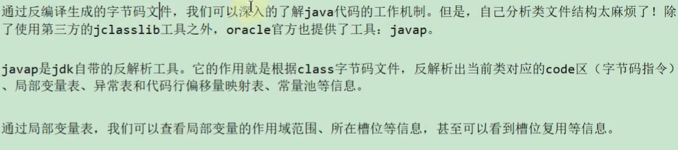
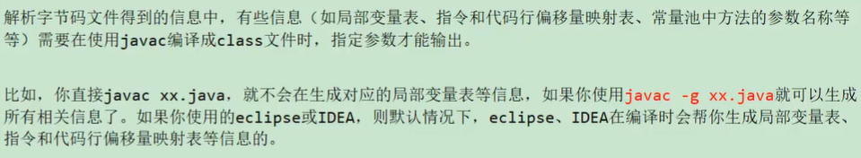
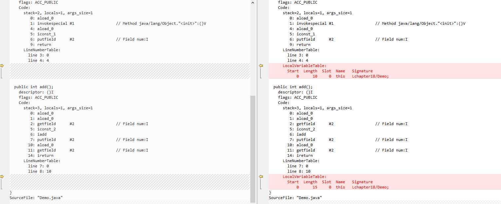
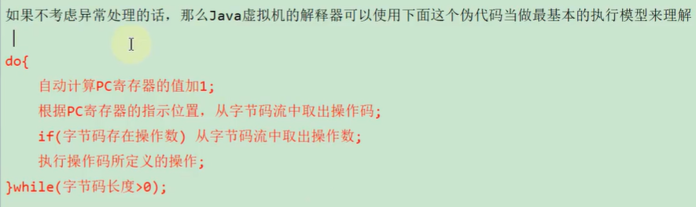
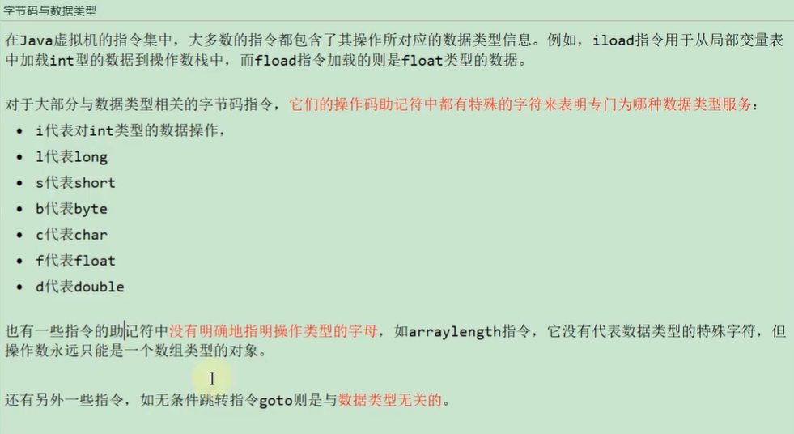
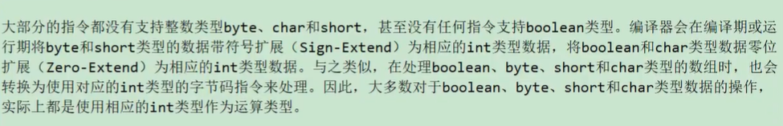

# 字节码解析
```text
Java语言是跨平台的，这就需要使用到Java虚拟机和字节码文件"class"文件这种特定二进制文件格式所关联。无论使用何种语言进行如阿健开发，
只要能将源文件编译为正确的Class文件，那么这种语言就可以在Java虚拟机上执行。可以说同易而强大的Class文件节后就是Java虚拟机的基石，桥梁。
```

```
想要让一个Java程序正确的运行在JVM中，Java源代码必须要被编译为符合JVM规范的字节码文件。
javac是一种能够将Java源码编译为字节码的前端编译器。
javac编译器在将Java源代码编译为一个有效果的字节文件的过程需要经历一下4个步骤:词法解析、语法解析、语义解析以及生成字节码。

```


#字节码文件是什么？
```text
字节码文件是一种二进制文件，它的内容是JVM指令，不像C/C++一样直接编译成机器码.
```
## 字节码指令是什么？
```text
Java虚拟机的指令是由一个字节的长度、代表着某种含义的操作码以及跟随其后的零至多个代表操作所需要的参数的操作数所构成
```

[字节码示例]
```shell
0 aload_0
1 invokespecial #1 <java/lang/Object.<init> : ()V>
4 aload_0
5 iconst_1
6 putfield #2 <chapter18/Demo.num : I>
9 return
```


# Class文件结构
## 魔数
```shell

每个class文件开头的4个字节的无符号整数称为魔数(Magic Number)

它的唯一左右是缺点这个文件是否为一个能够被虚拟机接受的有效合法的Class文件。即:魔数就是Class文件的标识符

魔数值固定为0xCAFEBABE,不会改变。

使用魔数而不是扩展名来进行识别主要是基于安全方面考虑，因为文件扩展名可以随意改动

```


## class 文件版本号


## 常量池
 
## 访问标识

## 类索引、父类索引、接口索引集合

## 字段表表集合

## 方法表集合


## 属性表集合


## javap命令查看字节码


### javap -g 指令


```text
从上面的图片可以知道使用javac -g多出了局部变量表
```


# 字节码指令集与解析
## 概述
* 执行模型


* 字节码与数据类型



* iload操作码(默认的只使用了iload_1~iload_3,这个范围使用的是最多的，超过的使用iload x的方式)
  * iload_0:标识将脚标为0的位置的数据压入操作数栈(整个只占一个字节的大小)
  * iload 0：标识将脚标为0的位置的数据压入操作数栈(操作码占一个字节，操作码占两个字节，总共占三个字节)


## 字节码连接的过程


### 连接阶段
```shell

在字节码的连接阶段的解析时，如果时非final修饰的变量，在解析的时候进行默认值初始化赋值
final修饰以后，在解析阶段直接进行显示的赋值。
拓展，如果时使用字面量创建字符串的话，就会在解析阶段显示的赋值，但是是new的方式就不是了。
```
[示例](./src/main/java/chapter19/LinkTest.java)


### 字节码的执行过程的初始化阶段
```text
类的初始化阶段时类装载的最后一个阶段，如果前面的步骤没有任何问题，那么标识类剋顺利装载到系统中。此时，类才会
开始执行Java字节码。(即:到了初始化阶段，才真正的执行类型的定义的Java程序代码)
初始化阶段最重要的工作就是执行类的初始化方法:<clinit>()方法
    * 该方法时又Java编译器生成并且又JVM调用，程序开发者无法自定义一个同名的方法，更无法直接在Java程序中调用
        该方法，虽然该方法也是又字节码指令所组成。
    * 它时由类静态成员的赋值语句以及static语句块合并产生的。    
    
说明：
1、 在加载一个类之前，虚拟机总是会试图加载该类的父类，因此父类的<clint>总是在子类的<clinit>之前被调用。
也就是说，父类的static块有限级高于子类。
2、 Java编译器并不会为所有的类都尝试<clinit>()初始化的方法，哪些类在编译为字节码后，字节码文件中将不会包含<clinit>()方法
    1、一个类中并没有声明任何的类变量，也没有静态代码块时
    2、一个类声明类变量，但是没有明确使用类变量的初始化语句以及静态代码块来执行初始化操作时
    3、 一个类中包含static final修饰的基本数据类型的字段，这些字段初始化语句采用编译时常量表达式    


```
[不生成\<clinit\>()方法的示例](./src/main/java/chapter19/InitializationTest.java)

```text
/**
 * 说明，使用static+final修饰的字段显式赋值的操作，到底是在哪个阶段进行赋值呢？
 * 场景1：在链接阶段准备环节赋值
 * 场景2：在初始化阶段的饿<clinit>()中赋值
 * 结论：
 * 1、对于基本数据类型的字段来说，如果使用了static final修饰，则显式赋值通常市在链接阶段的准备环节进行的，
 * 2、对与String来说，如果使用字面量的方式赋值，使用static final修饰的话，则显式赋值通常市在链接阶段的准备环节进行的。
 *
 * 在初始话阶段<clinit>()中赋值的情况
 * 排除上述的在准备环节的情况之外的情况
 *
 * 最终结论:使用static+final修饰的，且显式赋值不设计到方法或者构造器的调用的基本类型或String类型的显式赋值，市在链接阶段的准备环节进行的
 *
 */
```

```text
/**
 * 主动使用类的示例：
 * 1、当创建一个类的实例时，比如使用new关键字，或者通过反射、克隆、反序列化
 * 2、当调用类的静态方法时，即当使用了字节码invokestatic指令
 * 3、当使用类、接口静态字段时(final修饰特殊考虑)，比如getstatic 或者putstatic指令。(或者访问变量、赋值变量操作)
 * 4、当使用了java.lang.reflect包中的方法反射类的方法时。比如：Class.forName(“com.itdom.java.Test”)
 * 5、当初始化子类时，如果发现其父类还没有进行初始化，则需要先触发父类的初始化。
 * 6、如果一个接口定义了default方法，那么直接实现或者间接实现该接口的类的初始化，该接口要在其之前被初始化。
 * 7、当虚拟机启动时，用户需要指定一个要执行的主类(包含main()方法的那个类)，虚拟机会先初始化这个类。
 * 8、当初次调用了MethodHandle实例时，初始化该MethodHandle指向的方法所在的类，(涉及解析REF_getStatic、REF_putStatic、REF_invokeStatic方法句柄对应的类)
 */
```
[主动使用类](./src/main/java/chapter19/ActiveUseClassTest.java)

```text
/**
 * 被动使用的例子：
 * 1、当访问一个静态变量字段时，只有真正什么这个字段的类才会被初始化
 *      * 当通过子类uiny父类的静态变量，不会导致子类初始化
 * 2、 通数组定义类引用，不会触发此类的初始化
 * 3、引用常量不会触发此类或者接口的初始化。因为常量在链接阶段的准备环节就已经赋值了
 * 4、调用ClassLoader类的loadClass()方法加载一个类，并不是对类的主动使用，不会导致类的初始化
 */
```
[被动动使用类](./src/main/java/chapter19/PassiveTest.java)


