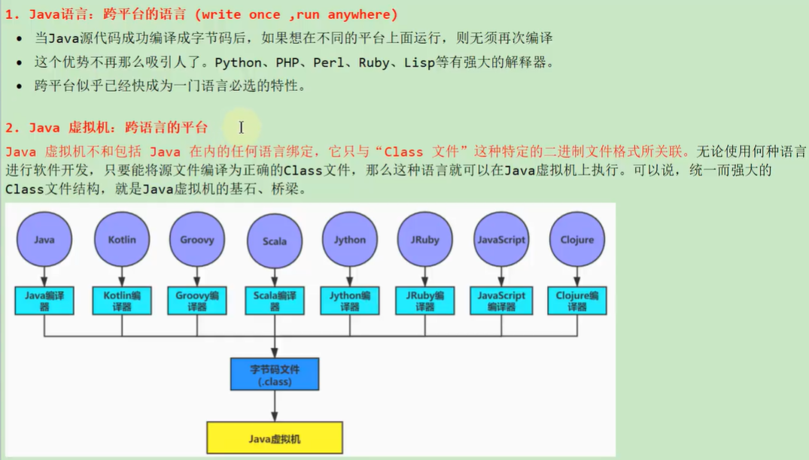
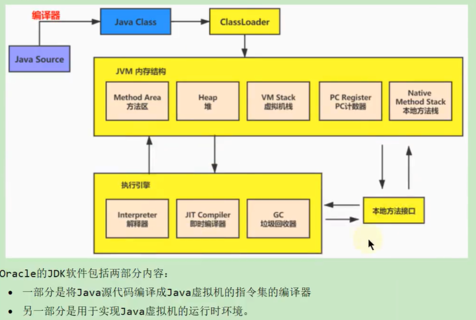

# 字节码解析
```text
Java语言是跨平台的，这就需要使用到Java虚拟机和字节码文件"class"文件这种特定二进制文件格式所关联。无论使用何种语言进行如阿健开发，
只要能将源文件编译为正确的Class文件，那么这种语言就可以在Java虚拟机上执行。可以说同易而强大的Class文件节后就是Java虚拟机的基石，桥梁。
```

```
想要让一个Java程序正确的运行在JVM中，Java源代码必须要被编译为符合JVM规范的字节码文件。
javac是一种能够将Java源码编译为字节码的前端编译器。
javac编译器在将Java源代码编译为一个有效果的字节文件的过程需要经历一下4个步骤:词法解析、语法解析、语义解析以及生成字节码。

```


#字节码文件是什么？
```text
字节码文件是一种二进制文件，它的内容是JVM指令，不像C/C++一样直接编译成机器码.
```
## 字节码指令是什么？
```text
Java虚拟机的指令是由一个字节的长度、代表着某种含义的操作码以及跟随其后的零至多个代表操作所需要的参数的操作数所构成
```

[字节码示例]
```shell
0 aload_0
1 invokespecial #1 <java/lang/Object.<init> : ()V>
4 aload_0
5 iconst_1
6 putfield #2 <chapter18/Demo.num : I>
9 return
```


# Class文件结构
## 魔数
```shell

每个class文件开头的4个字节的无符号整数称为魔数(Magic Number)

它的唯一左右是缺点这个文件是否为一个能够被虚拟机接受的有效合法的Class文件。即:魔数就是Class文件的标识符

魔数值固定为0xCAFEBABE,不会改变。

使用魔数而不是扩展名来进行识别主要是基于安全方面考虑，因为文件扩展名可以随意改动

```


## class 文件版本号


## 常量池

## 访问标识

## 类索引、父类索引、接口索引集合

## 字段表表集合

## 方法表集合


## 属性表集合


