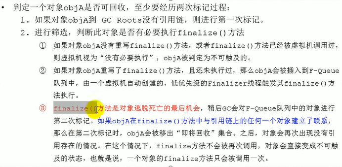
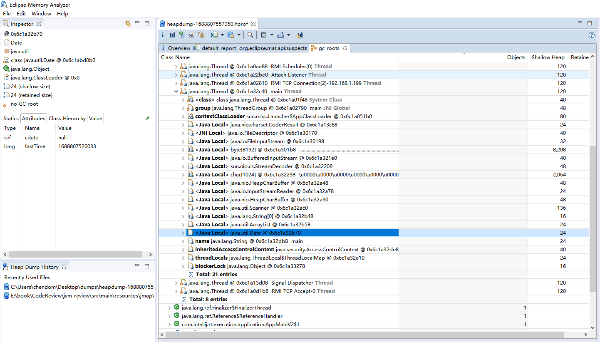
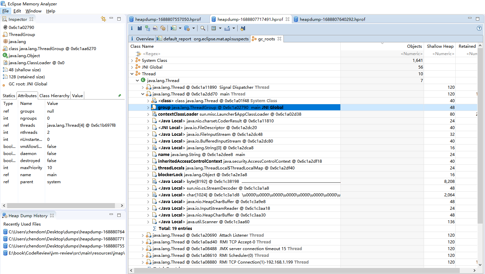
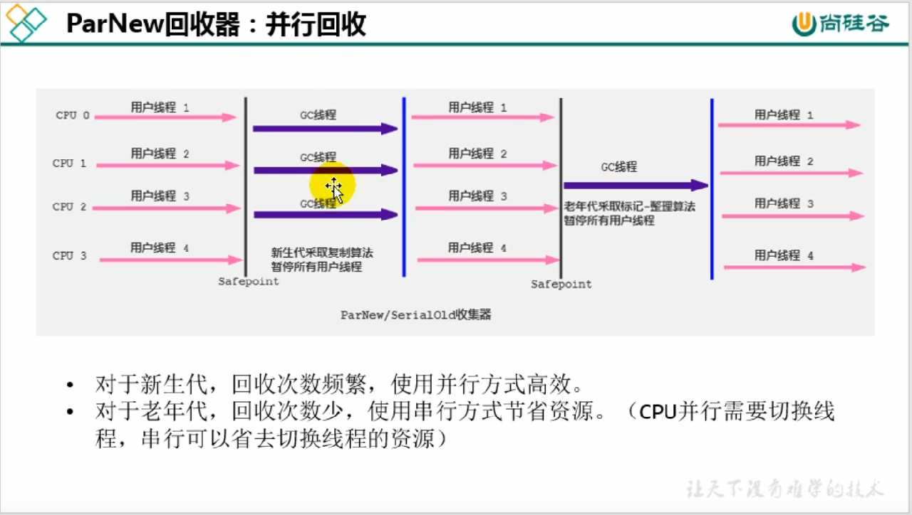
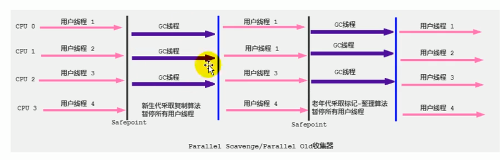
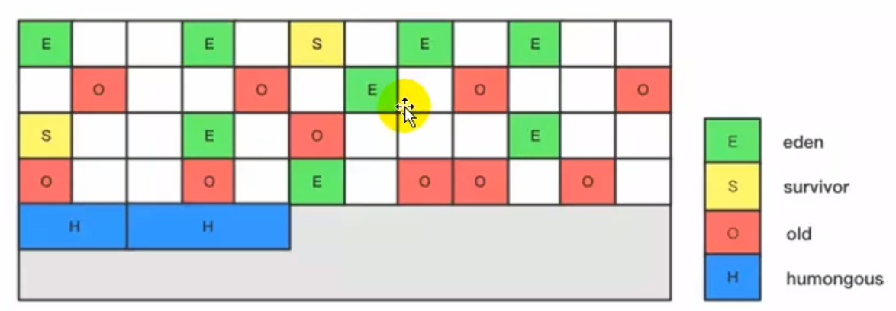
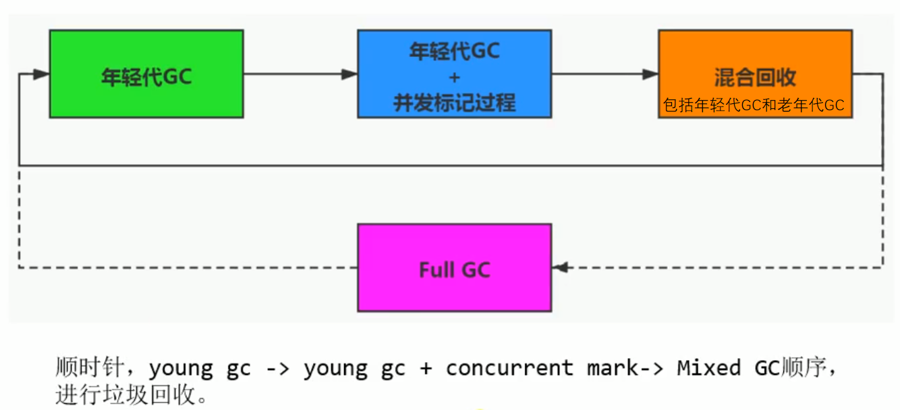

# 垃圾手机算法
## 引用计数算法
* 引用计数算法比较简单，对每个对象保存一个整型的引用计数器属性。用于记录对象被引用的情况。
* 对一个对象A，只要有任何一个对象引用了A，则的引用计数器就会加1，当引用失效时，引用计数器就减一。只要对象A的引用计数器的值为0,即表示对象A
  不可能在被使用了，可以进行回收
* 优点：
    * 实现简单，垃圾对象便于辨识；判定效率搞，回收没有延迟性。
* 缺点:
    * 它需要单独的字段存储计数器，这样就增加了存储空间的开销。
    * 每次赋值都需要更新计数器，伴随着假发和减法的操作，这增加了时间的开销
    * 引用计数器有一个严重的问题，即无法处理循环引用的情况。这是一条致命的缺陷，导致在Java的垃圾回收器中没有使用这类算法。


## 可达性分析(或根搜索算法，追踪性垃圾收集)
* 相对于引用计数算法而言，可达性分析算法不仅可同样具备实现简单和执行高效等特点，更重要的是搞算法可以有效的解决在引用计数算法中循环引用的问题，
  防止内存泄露的发生。
* 相较于引用计数算法，这里的可达性分析就是Java、C#选择的。这种类型的垃圾收集通常也叫做追踪性垃圾收集(Tracing Garbage Collection)

* GC Roots根集合就是一组必须活跃的引用
* 基本思路：
  * 可达性分析算法是以根对象集合(GC Roots)为起始点，按照从上至下的方式搜索被根对象集合所连接的目标对象是否可达。
  * 使用可达性分析算法后，内存中存货的对象都会被根对象集合直接或者简单的连接这，搜索所走过的路径称为引用链(Reference Chain)
  * 如果目标对象没有任何引用链，则是不可达的，就以为着该对象已经死亡，可以标记为垃圾对象
  * 在可达性分析算法中，只有能够被根对象集合直接或者间接连接的对象才是存货的对象
* Java语言中，GC Roots包括了一下几类元素：
  * 虚拟机栈中引用的对象
    * 比如：各个线程被调用的方法中使用到的参数、局部变量等。
  * 本地方法真内JNI(通常说的本地方法)引用的对象
  * 方法区中静态属性引用的对象
    * 比如：Java类的引用类型静态变量
  * 方法区中常量应用的对象
    * 比如：字符串常量池(String Table)里的引用
  * 所有被同步锁synchronized持有的对象
  * Java虚拟机内部的引用
    * 基本数据类型对于的Class对象，一些常珠的异常对象(如果NullPointerException、OutOfMemoryError),系统类加载器。
  * 反映Java虚拟机内部情况的JMXBean、JVMTI中注册的回调、本地代码缓存等.

* 除了以上固定的GC Roots集合以外，根据用户所选择用的垃圾收集器以及当前回收的内存区域不同，还可以有其他对象的”临时性“地加入，共同
完整GC Roots集合。比如:粉黛收集和局部回收(Partial GC)。
  * 如果值针对Java堆中地某一块区域进行垃圾回收(比如:典型的值针对新生代)，必须考虑到内存区域是虚拟机自己的实现细节，更不是孤立封闭的，
    这个区域的对象完全有可能被其他区域的对象所引用，这时候就需要一并将关联的区域对象也加入GC Roots集合中去考虑，才能保证可达性分析的准确性。
* 小技巧:
  * 由于Root采用栈方式存放变量和指针，所以如果一个指针，它保存了堆内存里面的对象，但是，自己有不存放在堆内存里面，那它就是一个Root。

* 注意：
  * 如果要使用可达性分析算法来判断内存是否可以回收，那么分析工作必须在一个能够保障一致性的快照中进行。这点不满足的话分析结果的准确性就无法得到保障。
  * 这点也是导致GC进行时必须”Stop The World“的一个重要原有。
    * 即时时号称(几乎)不会发生停顿的CMS收集器中，美剧根节点时也是必须要停顿的。


## 对象的finalization机制
* Java语言提供了对象终止(finalization)机制来允许开发人员提供对象销毁之前的自定义处理逻辑。
* 当垃圾收集器发现没有引用执行一个对象，即：垃圾回收此对象之前，总会先调用这个对象的finalize()方法
* finalize()方法允许在子类中被重写，用于在对象被回收时进行资源释放。通常在这个方法中进行一些资源的释放
  和清理的工作，比如关闭文件、套接字和数据库连接等。

* 注意：
  * 不要主动调用某个对象的finalize()方法，应该交给垃圾回收机制调用。理由包括以下三点:
    * finalize()时可能导致对象复活。
    * finalize()方法的执行时间是没有保障的，它完全由GC线程决定，极端的情况下，若不发生GC，则finalize()方法将不会被执行。
    * 一个糟糕的finalize()会严重的影响GC的性能。
  * 从功能上看，finalize()方法和C++的析构函数比较相似，但是Java采用的是基于垃圾回收器的自动内存管理机制，所以fianlize()方法在本只上不同于C++
    的析构函数
* 由于finalize()方法的存在，虚拟机中的对象一般处于三种可能的状态。
  * 如果从根节点都无法访问到某个对象，说明对象以及不再使用了。一般来说，此对象就需要被回收。但是，事实上，也并非是”非死不可“的，这时候他们暂时
    处于”缓刑“阶段。一个无法触及的对象有可能在某一个条件下”复活“自己，如果这样，那么对它的回收就是不合理的，为此，定义虚拟机中的对象可能存在
    三种状态：
    * 可触及的：从根节点开始，可以到达的对象。
    * 可复活的：对象的所有引用都被释放，但是对象可能在finalize()复活
    * 不可触及的：对象的finalize()被调用，并且么有复活，那就会进入不可触及的状态。不可触及的对象不可能被复活，以为fianlize()指挥被调用一次。
  * 以上2种状态种，是由finalize*)方法的村子啊，进行区分。只有在对象不可触及时才可以被回收。

* finalization机制执行的过程


finalize()方法复活对象示例：
```java
package chapter15;

/**
 * finalize()方法将对象复活
 *
 *
 */
public class CanReliveObj {
    public static CanReliveObj canReliveObj;

    @Override
    protected void finalize() throws Throwable {
        super.finalize();
        System.out.println("重写了对象的finalize()方法");
        canReliveObj = this;
    }

    /**
     * 执行结果：
     * 重写了对象的finalize()方法
     * 第一次调用GC
     * canReliveObj still alive
     * 第二次GC
     * canReliveObj is dead
     */
    public static void main(String[] args) throws InterruptedException {
        canReliveObj = new CanReliveObj();
        canReliveObj=null;
        System.gc();
        System.out.println("第一次调用GC");
        Thread.sleep(2000L);
        if (canReliveObj==null){
            System.out.println("canReliveObj is dead");
        }else {
            System.out.println("canReliveObj still alive");
        }
        System.out.println("第二次GC");
        canReliveObj=null;
        System.gc();
        Thread.sleep(2000L);
        if (canReliveObj==null){
            System.out.println("canReliveObj is dead");
        }else {
            System.out.println("canReliveObj still alive");
        }
    }
}

```

## MAT查看GC Roots




## Jprofiler查看GC Roots


## 垃圾收集算法

### 标记-清楚算法

### 复制算法

### 标记-整理算法


### 分代收集算法
JVM虚拟机的内存时按照代去划分的，比如年轻代，老年代，永久代等，每个代的生命周期都是不一样的，
那么根据上面垃圾收集算法算法的不同的优缺点就需要选择性的去使用，这样才能提供垃圾收集的效率。

### 增量收集算法
本只上就是复制算法和标记清除算法，只是每次都只是执行一小片区域的垃圾收集，该区域垃圾收集完成之后
就迅速的切换到用户线程执行，使得垃圾收集和用户线程可以交替使用，而不至于使得用户等待，但是这个方式
需要不断的切换线程，其实线程的切换也是很耗费资源的。


### 分区算法


[垃圾收集的示例](./src/main/java/chapter16/LocalVariableGC.java)


## 安全点
```text
程序执行时并非所有地方都能够停下来开始GC，只有在特定的位置才能够停顿下来开始GC，这些位置称为"安全点(Safepoint)"

Safe Point的选择很重要，如果太少可能导致GC等待的时间太长，如果太频繁可能导致运行时的性能问题。大部分指令的执行时间都是
非常短暂，通常会根据"是否具有让程序长时间执行的特征"为标准。比如：选择一些执行时间较长的指令作为Safe Point，比如方法调用，
循环跳转和异常跳转等。
```
问题：
1.如何在GC发生的时候，检查所有线程都跑到最近的安全点停顿下来呢？
  1.抢先式中断(目前没有虚拟机采用了)
    首先中断所有的线程，如果还有线程不在安全点，就回复线程，让线程跑到安全点
  2.主动式中断：
    设置中断标志，各个线程都运行到Safe Point的时候主动轮询这个标志，如果中断标志为真，则将自己进行中断挂起。

* 实际执行时：
1. 当前咸亨运行到Safe Region的代码时，首先标识已经进入了Safe Region,如果这段时间内发生了GC，JVM会忽略标识为Safe Region状态的线程。
2. 当线程即将离开Safe Region时，会检查JVM是否已经完成了GC，如果完成了，则继续运行，否则必须等待直到收到可以安全离开Safe Region的信号为止.


## 引用

FinalReference
PhantomReference
Reference
ReferenceQueue
SoftReference
WeakReference

Reference子类中只有终结器引用是包内可见的，其他三种引用类型均为public,可以在应用程序中直接使用。
* 强引用(StrongReference):最传统的"引用"的定义，是指在程序代码之中普遍存在的引用复制，即类似"Object obj = new Object()"这种引用关系。无论
  任何情况下，只要强引用关系还存在，垃圾收集器永远不会回收掉引用的对象。
* 软引用(SoftReference):在系统将要发生内存溢出之前，将会把这些对象列入回收范围之中进行第二次回收。如果这次回收之后还没有足够的内存，才会抛出内存
  溢出异常。
  * [软引用示例](./src/main/java/chapter16/SoftReferenceTest.java)
* 弱引用(WeakReferene):被弱引用关联的对象只能生存到下一次垃圾收集之前。当垃圾收集器工作时，无论内存空间是否足够，都会回收掉弱引用关联的对象。
  * [弱引用示例](./src/main/java/chapter16/WeakReferenceTest.java)
* 虚引用(PhantomReference):一个对象是否又虚引用存在，完全不会对其生存时间构成影响，也无法通过虚引用来获得一个对象的实例。为一个对象设置虚引用关联的
  * [虚引用示例](./src/main/java/chapter16/PhantomReferenceTest.java)
  唯一目的就是能在这个对象被收集器回收时收到一个系统通知。

### 评估GC的性能指标
* 吞吐量:运行用户代码的时间占总运行时间的比例
  * (代码运行时间/(程序运行时间+内存回收的时间))
* 垃圾收集开销:吞吐量的补数据、，垃圾收集所用时间与总运行时间的比例。
* 暂停时间:执行垃圾收集时，程序的工作现场被暂停的时间。
* 收集频率:相对于应用程序的执行，收集操作发生的频率。
* 内存占用:Java对区所占的内存大小。
* 快速:一个对象从诞生到被回收所经历的时间


# 垃圾收集器
[垃圾收集器的组合使用](./files/垃圾收集器的组合-1.png)

```text
1、连各个收集器之间有连线，表明它们可以搭配使用：
Serial/Serial Old、Serial/CMS、ParNew/Serial Old、ParNew/CMS、
Parallel Scavenge/Serial Old,Parallel Scavenge/Parallel Old、G1
2、其中Serial Old作为CMS出现"Concurrent Model Failure"失败的后备预案。
3、(红色虚线)由于维护何兼容性测试的成本，在JDK1.8时间将Serial+CMS、ParNew+Serial Old这两个组合声明为废弃（JEP 173）
   ,并且在JDK9中完全取消了这些组合的支持(JEP124),`即：移除
4、(绿色虚线)JDK 14中:弃用Parallel Scavenge和Serial Old GC组合(JEP 366)   
```
[查看JVM参数示例](./src/main/java/chapter17/GCCommandLineTest.java)
使用命令行看`
```shell
C:\Users\chendom>jinfo -flag UseParallelGC 7600
-XX:+UseParallelGC
C:\Users\chendom>jinfo -flag UseParallelOldGC 7600
-XX:+UseParallelOldGC //说明JDK1.8默认使用的是ParallelGC
```


##Serial回收器：串行回收
* Serial收集器是最基本、历史最悠久的垃圾收集器了。JDK1.3之前回收新生代唯一的选择。
* Serial收集器作为HotSpot中Client模式下的默认新生代垃圾收集器。
* Serial收集器采用复制算法，串行回收和"Stop-the-World"机制的方式执行内存回收
* 除了年轻代之外，Serial收集器还提供了用于执行老年代垃圾收集的Serial收集器。Serial Old收集器同样采用了串行回收和"Stop the World"机制，
  只不过内存回收算法使用的是标记-压缩算法。
  * Serial Old是运行在Client模式下默认的老年代的垃圾回收器
  * Serial Old在Server模式下主要有两个用途:1.与新生代的Parallel Scavenge配合使用 2、作为老年代CMS收集器的后背垃圾收集方案.

* 优势：
简单高效(与其他收集器的单线程比)，对于限定单个CPU的环境来说，Serial收集器由于没有线程交互的开销，专心做垃圾收集自然可以获得最高的大年初收集效率。
运行在Client模式下的虚拟机是个不错的选择。
* HotSpot虚拟机中，使用-XX:+UseSerialGC参数可以指定年轻代和老年带都使用串行收集器

总结:
这种垃圾收集器了解即可，现在一般都不使用串行垃圾收集器了。而且在限定单核CPU才可以使用，现在一般不存在单核的设备了。
对于交互较强的应用而言，这种垃圾收集器不是被接受的。一般在Java web应用程序中不会采用串行垃圾收集器。

## ParNew垃圾收集器
ParNew是Serial收集器的多线程版本，Par是Parallel的缩写，New代表了在新生代收集
ParNew采用的是并行回收的方式执行内存的回收外，两款垃圾收集器之间几乎没有任何区别。ParNew收集器在年轻代中同样采用复制算法，"STW"机制。
ParNew是很多JVM运行在Server模式下新生代的默认垃圾收集器.


   ParNew垃圾收集器可以在多CPU的环境下，充分的利用CPU的资源优势，可以更快的完成
垃圾收集，提升吞吐量。
    但是在单个CPU的环境下，由于线程的切换需要更多的开销，所以，在这种情况下ParNew未必
能够比Serial好
```shell
 -XX:+UseParNewGC设置使用ParNew垃圾收集器,
-XX:InitialHeapSize=266668608 -XX:MaxHeapSize=4266697728 -XX:MaxNewSize=348966912 -XX:MaxTenuringThreshold=6 -XX:OldPLABSize=16 -XX:+PrintCommandLineFlags -XX:+UseCompressedClassPointers -XX:+UseCompressedOops -XX:+UseConcMarkSweepGC -XX:-UseLargePagesIndividualAllocation -XX:+UseParNewGC
 在JDK7以及以前，默认的都是ParNew配合SerialOld使用，但是到了JDK8，就直接去掉了这个组合，转而使用ParNew+ConcMarkSweep+SerialOld(备选)。
 -XX:ParallelGCThreads=4设置并行收集垃圾的线程数量
 -XX:InitialHeapSize=266668608 -XX:MaxHeapSize=4266697728 -XX:MaxNewSize=348966912 -XX:MaxTenuringThreshold=6 -XX:OldPLABSize=16 -XX:ParallelGCThreads=4 -XX:+PrintCommandLineFlags -XX:+UseCompressedClassPointers -XX:+UseCompressedOops -XX:+UseConcMarkSweepGC -XX:-UseLargePagesIndividualAllocation -XX:+UseParNewGC
  
```

##ParallelGC
ParallelGC和ParNew一样都是并行回收垃圾的典型垃圾收集器，都采用了复制算法，并行回收和"STW"机制。
但是Parallel和ParNew有两点不一样：
1、Parallel Scanvenge收集器的目标是达到一个可控制的吞吐量，它也被称为吞吐量有限的垃圾收集器。
2、自适应调节策略也是Parallel Scanvenge 与ParNew的一个重要区别

* Parallel Scanvenge适合在不需要太多交互的任务，在JDK1.6的时候，Parallel提供了执行老年代的垃圾收集器ParallelOld,用来代替老年代
  Serial Old收集器
* Parallel Old收集器采用的是标记-压缩算法，但同样是基于并行回收、"Stop-the-World"机制。



### 相关参数设置
* -XX:+UseParallelGC 手动设置年轻代使用Parallel并行收集器执行内存回收任务
* -XX:+UseParallelOldGC 手动指定老年代是并行回收收集器
  * 分别使用与新生代和老年代。默认jdk8是开启的。
  * 上面的参数，默认开启一个，另外一个是回被开启的(互相激活)
* -XX:ParallelGCThreads 设置年轻代并行收集器的线程数。一般地，嘴还与CPU数量相等
  以避免过多的线程数影响到垃圾收集性能。
  * 默认情况下，当CPU小于8时，ParallelGCThreads的值等于CPU数量。
  * 当CPU数量大于8时，ParallelGCThreads的值等于3+[5*CPU_COUNT]/8
* -XX:+MaxGCPauseMillis 设置垃圾收集器最大停顿时间(STW时间)，单位为毫秒
  * 为了尽可能的把停顿时间控制在MaxGCPauseMills以内，收集器在工作事会跳转Java堆大小或者其他一些参数。
  * 对于用户来说，停顿时间越短体验越好。但是，在啊服务器端，我们注重的高并发，整体的吞吐量。所以服务器端适合Parallel，进行控制
  * 该参数使用需要谨慎，
* -XX:GCTimeRatio垃圾收集时间占总时间的比例(=1/(N+1)).
  用于衡量吞吐量的大小
  * 取值范围（1，100）。默认是99，也就是垃圾收集时间不超过1%。
  * 与前一个-XX:MaxGCPauseMillis参数有一定矛盾。暂停时间越长，Radio参数就容易超过设定的比例。
* -XX:+UseAdativeSizePolicy 设置Parallel Scavenge收集器具有自适应调节策略
  * 在这种模式下，年轻回到的大小、Eden和Survivor的比例，晋升老年代的对象年龄等参数会被自定调整，i达到在堆大小、吞吐量和停顿时间之间的平衡点。
  * 在手动调优比较困难的场合，可以直接使用这种自适应的方式，仅指定虚拟机的最大堆、目标的吞吐量(GCTimeRatio)和停顿是按(MaxGCPauseMillis),
    让虚拟机自己完成调优工作。


    


* G1的特点
  * 并行性和并发行：
    * 并行性：G1垃圾回收器间，允许有多个线程一起执行，充分的利用了多核的运算能力，此时的用户线程是"STW"。
    * 并发性:G1拥有与用户线程交替执行的能力，部分工作可以和应用程序同事执行，因此，一般来说不会在整个
      回收阶段发生完全阻塞应用程序的情况。
  * 分代收集：
    * 从分代上看，G1依然属于分代型垃圾收集器，它会区分年轻代、老年代。年轻代依然存在Eden去，Survivor区域。
      但是，在结构上看，它不要求真个Eden区，年轻代或者老年代是连续的，也不再坚持固定大小的和固定数量。
    * 将堆空间氛围若干个区域(Region)，这些区域包含了逻辑上的年轻代和老年代。
    * 和之前的各类回收器不同，它同时代兼顾年轻代和老年代，对比其他回收器，或者工作在年轻代，或者工作在老年代。
  * 可预测的停顿时间模型：
    这是G1相对于CMS的另一大优势，G1除了追求低停顿外，还能建立客预测的停顿时间模型，能让使用这明确指定在一个
    长度为M好i按的时间片段内，消耗在垃圾收集上的时间步得超过N好眠
    * 因为分区的原因，G1不需要全堆收集，只需要收集部分区域即可，因此，缩小了回收的范围，因此对于全局停顿情况的发生也能得到较好
      的控制
    * G1跟踪各个Region里面的垃圾堆积的价值大小(回收所获得的空间大小以及回收所需要的时间经验值)，在后台维护一个
      有限列表，每次跟胡允许的收集时间，有限回收价值最大的Region，保证了G1收集器在有限的时间内可以获取尽可能高的效率。
    * 相比于CMS GC，G1未必能做到最好的延迟停顿，但是最差情况要好很多。
  


* G1的缺点：
  * 相较于CMS，G1还不具备全方位的，压倒性优势。比如在用户程序允许过程中，G1无论是为了垃圾收集产生的内存占用，还是程序运行是的
    额外负载(Overload)都要比CMS要高。所以在小内存的应用上CMS表现大概率是要优于G1，而在大内存的应用上则才可以发挥其优势。平衡
    点在6~8GB之间。
  


## G1收集器
```text
虽然有了很多优秀的收集器，但是随着业务越来越庞大、复杂、用户数激增,GC时的"STW"时间越来越无法满足实际的需求,因此,在JDK7的update 4版本引入了G1垃圾
收集器。随着处理器和内存的不断增大，一款能够在可控延迟，大吞吐量的收集器就很有必要。
```
* 名字的来由
```text
1、G1是一个并行的回收的垃圾收集器，它把内存不相关的额区域(Reghion)(物理上不连续的)。使用不相同的Region来表示Eden、幸存者0区域、幸存者1区、老年代.
2、G1 GC有计划的避免在整个Java堆中进行全区域的垃圾收集，G1跟踪哥哥Region里面的垃圾堆积额价值大小(回收所获得的空间戴奥以及回收所需时间的经验值)，在后台维护一个优先
  列表，每次根据允许的手机时间，有限回收价值最大的Region.
3、这种方式重点在于回收垃圾最大量的区间(Region),所以我们给G一个名字：垃圾优先(Garbage First)。
```

* G1垃圾收集器处理的场景
```text
1、G1是一款面向服务端点应用的垃圾收集器,主要针对配备多核CPU及大容量内存的机器，以极高概率满足GC停顿时间的同事，还兼具高吞吐量的性能特征
2、G1是JDK1.7开始启用的垃圾收集器，并且移除了Experimental标识，在JDK9以后的默认垃圾收集器，取代了CMS垃圾回收期以及Parallel Scanvenge+Prallel Old组合垃圾收集器，
被Oracle官方称为"全功能的垃圾收集器"。
3、同时，CMS在JDK9被标记为废弃(deprecated),在jdk8中还是默认的垃圾回收期，需要使用-XX:+UseG1GC来启用,JDK14的版本CMS被移除。

```


* G1垃圾收集器的参数设置
  * -XX:+UseG1GC 手动指定使用G1收集器执行内存回收任务
  * -XX:G1HeapRegionSize 设置每个Region的大小。值是2 的幂，范围是1MB~32MB之间，目标是跟胡最小的Java堆大小划分出月2048个区域。
    默认是堆内存的1/2000.
  * -XX:MaxGCPauseMillis 设置期望达到的最大GC停顿时间指标(JVM会尽力实现，但不保证达到)。默认值是200ms
  * -XX:ParallelGCThread 设置STW时GC线程树的值。最多设置为8
  * -XX:ConcGCThreads 设置并发标记的线程数。将n设置为并行牢记回收线程数(ParallelGCThreads)的1/4左右
  * -XX:InitialtingHeapOccupancypercent 设置触发并发GC周期的Java堆占用率阈值。超过此值，就触发GC，默认值就是45.堆空间已用占比达到45%，
    老年代才会并发标记。

* G1回收器的常见操作步骤
```text
G1的设计原则就是简化JVM性能的调优，开发人员只需要简单的三步即可完成调优：
第一步：开启G1垃圾收集器
第二步:设置堆的最大内存
第三步:设置最大的停顿时间
G1中提供的了三种垃圾回收模式:YoungGC、Mixed GC和Full GC，在不同的条件下被触发。
```

* G1垃圾回收器的使用场景
  * 面向服务端应用，针对具有大内存，多处理器的机器。(在普通大小的堆里表现并不惊喜)
  * 最主要的应用需要低GC延迟，并具有大堆的应用程序提供解决方案。
  * 如：在堆大小月6GB或者更大时，可以预测的暂停时间可以低于0.5秒；(G1通过每次只清理一部分而不是全部的Region的增量式清理老保证每次GC停顿时间不会过长)
  * 用来替换掉JDK1.5中的CMS收集器：
    * 在下面的情况时，使用G1可能比CMS好
      * 超过50%的Java堆被活动数据占用
      * 对象分配的频率或年代提升频率变化很大
      * GC停顿时间过长(change2约0.5~1秒)
      * HotSpot垃圾收集器里，除了G1以外，其他的垃圾收集器使用内置的JVM线程执行GC的多线程操作，而G1 GC可以采用应用线程承担后台运行的GC工作
        即当JVM的GC线程处理速度慢时，系统会调用应用小恒徐帮助加速垃圾回收过程。

* G1分区Region:化整为零
  * 使用G1收集器时，它将整个Java堆划分为约2048个大小相同的独立Region块，每个Region块大小根据堆空间的实际大小而定，整体被控制在1MB~32MB之间,
    且为2的N次幂，即1MB,2MB,4MB,8MB,16MB,32MB.可以听过-XX:G1HeapRegionSize设定。所有的Region大小相同，且在JVM生命周期内不会被改变.
  * 虽然还保留有新生代和老年代的概念，但新生代和老年代不再时物理隔离的了，他们都是一部分Region(不需要连续)的集合。通过Region的态分配方式实现
    逻辑上的连续。
  * 注意：
    * 如果设置了Region的数量，那么Rgion带线啊哦就是不固定的，但是大小肯定时2的幂次方，并且在1~32MB之间
    * 如果设置了Region大小，那么Region数量就是不固定的，但是肯定时在2048附近。


Region只是Eden、Survivor、Humongous中的一种，但是它的身份不是固定的，谁来占用那么这个Rgion就是谁
* 一个Region有可能属于Eden、Survivor或者Old/Tenured内存区域。但是一个region只可能属于一个角色。
* G1垃圾收集器还增加了一种心的内存区域，叫做Humongous内存区域，如图中的H块，主要用于存储大对象，如果1.5
  个region，就放到H区域。
* 设置H区域的原因：
  * 对于大对象，默认直接会被分配到老年代，但是如果它时一个短期存在的对象，就会堆垃圾收集器造成负面影响。为了解决这个问题，G1
    划分除了一个Humongous区，它用来专门存放大对象。如果一个H区域装不下一个大对象，那么G会寻找连续的H区域来存储。为了能够找到连续的
    H区，有时候不能不启动Full GC。G1的大多数行为都把H区作为老年代的一部分来看待。


* G1回收的过 程 
G1 GC的垃圾回收过程主要包括一下三个环节：
1. 年轻代GCyoung gc
2. 老年代并发标记过程(Conccurrent Marking)
3. 混合回收(Mixed GC)



```text

应用程序分配内存，当年轻代的Eden区用尽时开始年轻代回收的过程；G1的年轻代收集阶段是一个并行的独占是式子收集器，在年轻代回收期，G1 GC暂停所有
的应用程序线程，启动多线程执行年轻代回收。然后从年轻代区间移动存活对象的Survivor区间或者老年区间，也有可能是两个区间都会涉及。

当堆内存使用达到一定值(默认45%)时，开始老年代并发标记过程。

标记完成马上开始混合回收的过程。对于一个混合回收期，G1 GC从老年代区间移动到存活对象到空闲区间，这些空间区间也就成为了老年代的一部分。和年轻代不
同，老年代需要扫描/回收一小部分老年代的Regiob就可以了。同事，这个老年代Region是和年轻代一起被回收的。

```
 

* Remembered Set
  问题：
  * 一个对象被不同的区域引用的问题
  * 一个Region中的对象被其他任意的Region中的对象引用，判断对象的存活时，是否需要扫面整个Java堆才可以确保准确？
  * 在其他的分代收集器，也存在这个的问题(而G1更加的突出)
  * 回收新生代也不得不同事扫描老年代
  * 这样的话会降低Minor GC的效率。
  * 解决的方法：
    * 无论是G1还是其他分代收集器，JVM都是使用Remebered Set来避免全局扫面
    * 每个Region都有一个对于的Remembered Set；
    * 每次Reference类型疏忽写操作时，都会产生一个Write Barrier暂时中断操作；
    * 然后检查将要写入的引用指向的对象是否和该Reference类型的数据在不同的Region(其他的收集器：检查老年代的对象是否引用了新生代的对象)
    * 当进行垃圾收集时，在GC根节点的美剧范围加入Remembered Set;就可以避免全局扫描，也不会有遗漏。


