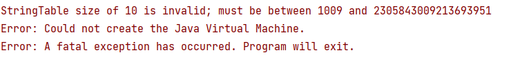

# 字符串
```shell
1. 在JDK1.8以及之前的版本都是使用char[] char数组的方式进行存储，但是在JDK1.9开始，Java将原来使用char数组存储的方式改成了byte数组
2. String:代表了不可变的字符串序列。简称：不可变性。
  1. 当堆字符串重新赋值时，需要重写指定内存区域赋值，不能使用原有的value进行赋值
  2. 当堆现有的字符串进行连续操作时，也需要重新指定内存区域赋值，不能使用原有的value进行赋值。
  3. 当调用String的replace()方法修改指定字符或者字符串时，也需要重新指定内存区域赋值，不能使用原有的value进行赋值。
3. 通过字面量的方式(区别于new)给一个字符串赋值，此时的字符串值声明在字符串常量池中。  

```
示例
```java
package chapter13;

/**
 * 验证字符串
 */
public class StringTest {
    public static void main(String[] args) {
//        extracted();
        StringTest stringTest = new StringTest();
//        stringTest.test1();
//        stringTest.test2();
        stringTest.test3();
    }

    /**
     * true
     * abc
     * abc
     */
    public void test1() {
        String s1 = "abc";//字面量定义的方式，"abc"存储在字符串常量池中
        String s2 = "abc";
//        s1 = "hello";
        System.out.println(s1 == s2);
        System.out.println(s1);
        System.out.println(s2);
    }

    /**
     * false
     * abcdef
     * abc
     */
    public void test2() {
        String s1 = "abc";//字面量定义的方式，"abc"存储在字符串常量池中
        String s2 = "abc";
        s1 += "def";//拼接会重新生成一个字符串
        System.out.println(s1 == s2);
        System.out.println(s1);
        System.out.println(s2);
    }

    public void test3() {
        String s1 = "abc";
        String s2 = s1.replace("a","w");//使用replace会重新生成一个字符串
        System.out.println(s1 == s2);
        System.out.println(s1);
        System.out.println(s2);
    }
}

```


```shell
设置字符串常量的大小
-XX:StringTableSize
JDK1.6是1009
JDK7 60013
JDK8以及之后的版本1009时可以设置的最小值，否则会报错

C:\Users\chendom>jinfo -flag StringTableSize 15816
-XX:StringTableSize=60013

```



## String的特性
```shell
1. String的String Pool是一个固定大小的Hashtable，默认值大小长度是1009。如果放进去的String非常多，就会造成Hash冲突严重，从而导致链表过长，
而链表长了之后会直接造成调用String.intern时性能会大幅下降。

```

## String的操作图解
[字节码刨析](./files/String操作-1.PNG)
[图解](./files/String操作-2.PNG)

* 注意:字节码中的param参数时存在第一位，第0位是用来存储this关键字的。


## String的内存分配
* JDK6 及以前，字符串常量池存放在永久代
* JAVA7中的oracle的工程师对字符串常量池的逻辑做了很大的改变，即将字符串常量池的位置调整为Java堆
    *　所有的字符串保存在堆中，和其他普通对象一样，这样可以让你在进行调优应用是仅需要调整堆大小就可以。
    * 字符串常量池概念原本使用的比较多，但是这个改动使得我们有足够的理由让我们重新考虑在Java7中使用String.intern()
* Java8元空间，字符串常量在堆

###字符串拼接
```markdown
* 常量与常量的拼接结果在常量池，原理是编译期优化
* 常量池中不回存在相同的内容常量
* 只要其中一个是变量，结果就是在堆中。变量凭借的二元论是StringBuilder
* 如果拼接的结果调用了intern()方法，则主动将常量池中没有的字符串对象放入池中，并返回对象的地址
```


